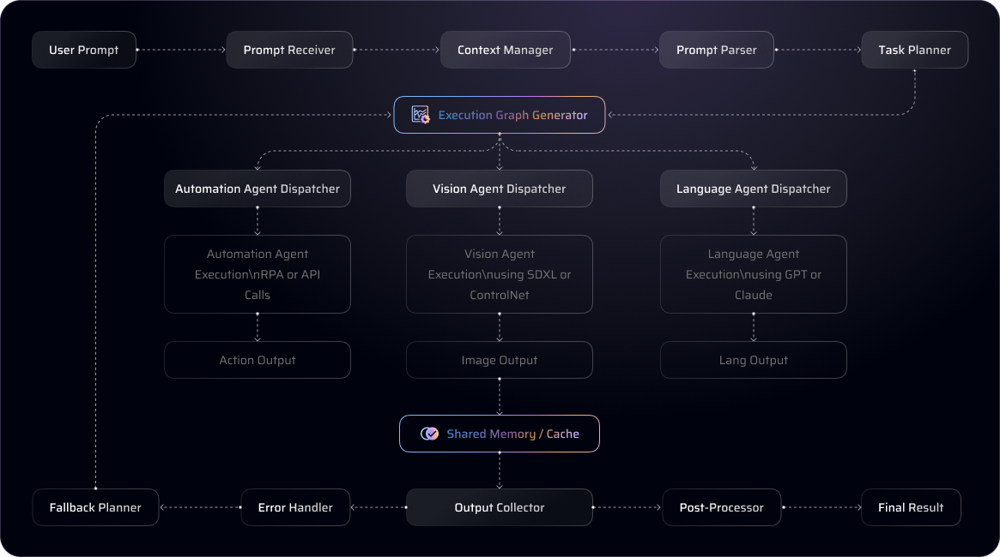

<h1 align="center">Emeron 🕳 Protocol</h1>
<p align="center">
  
</p>
<p align="center">
  <b>Language. Orchestrated. Emergent. The control layer for intelligent execution.</b><br/>
</p>

<p align="center">
  <b>CA:4iy9Y2nJ6t3dAWH7GmZjtKukPNayKCUmGTZZqg5xpump</b><br/>
</p>

---

## Overview

Emeron is a language-native orchestration protocol designed to coordinate intelligent agents with minimal friction. Through natural language, users can trigger complex multi-agent workflows, access databases, and interact with local or cloud-hosted models—without writing a single line of code.

Emeron simplifies control. Whether you're running queries, managing resources, or automating tasks, Emeron transforms intent into action via the MCP (Multi-Agent Control Protocol) architecture.

---

## Contents

- [Core Capabilities](#core-capabilities)
- [System Blueprint](#system-blueprint)
  - [Integration Modes](#integration-modes)
  - [Execution Flow](#execution-flow)
- [Quick Start](#quick-start)
  - [Install via pip](#install-via-pip)
  - [Custom Deployment](#custom-deployment)
- [Agent Configuration](#agent-configuration)
  - [Model Selection](#model-selection)
  - [Database Integration](#database-integration)
- [Run Emeron](#run-emeron)
  - [Supported Clients](#supported-clients)
- [FAQ](#faq)
- [References](#references)

---

## Core Capabilities

- 🔍 Query data via natural language
- 🤖 Compatible with GPT-based LLMs, text-to-SQL transformers, and secure local models
- 🛡️ Fully operational in local environments (privacy-first mode)
- 🗃️ Supports MySQL, PostgreSQL, with more dialects in development
- 🔗 Access schema resources and inspect live tables on demand
- 🛠️ Dynamically translate intent to SQL and retrieve actionable results

---

## System Blueprint

### Integration Modes

Emeron supports two deployment strategies:

- **Remote Mode** *(Default)*: Leverage powerful cloud-hosted LLMs. Requires valid API keys for external model endpoints.
- **Local Mode**: Run models on-premises for enhanced privacy and control. Suitable for secure environments.



---

### Execution Flow

1. Input intent via natural language.
2. Emeron parses, decomposes, and routes the request to appropriate agents.
3. SQL is generated and executed across connected databases.
4. Results are aggregated and returned through the Emeron interface.

---

## Quick Start

### Install via pip

Ensure Python 3.11+ is installed.

```bash
pip install emeron-core
```

To launch the server:

```bash
python -m emeron_core
```

Provide your configuration to activate features:

```bash
env CONFIG=config.yml python -m emeron_core
```

---

## Agent Configuration

### Model Selection

Define your preferred model, key, and endpoint in `config.yml`. Emeron supports:

| Type         | Model Examples                              | API Key Required | Endpoint Example                           |
|--------------|---------------------------------------------|------------------|--------------------------------------------|
| Cloud LLMs   | GPT-3.5, qwen-max                           | Yes              | https://api.openai.com/v1                  |
| Text-to-SQL  | EmeronSQL-32B (Modelscope)                  | Yes              | https://api-inference.modelscope.cn/v1/    |
| Local Model  | EmeronSQL-3B (runs locally, slower)         | No               | http://localhost:5090                      |

Example configuration for GPT:

```yaml
model:
  name: "gpt-3.5-turbo"
  key: "YOUR_API_KEY"
  url: "https://api.openai.com/v1"
```

---

### Database Integration

Emeron seamlessly integrates with MySQL and PostgreSQL:

```yaml
database:
  dialect: "mysql"  # or "postgresql"
  host: "localhost"
  port: 3306
  user: "root"
  password: "password"
  database: "example_db"
```

---

## Run Emeron

Emeron can integrate with various environments. For example:

### Custom Clients
```json
{
  "servers": {
    "emeron-core": {
      "command": "/usr/bin/python3",
      "args": [
        "-m",
        "emeron_core"
      ],
      "env": {
        "CONFIG": "/path/to/config.yml"
      }
    }
  }
}
```

---

## FAQ

- **What is Emeron?**  
  Emeron is a language-native orchestration platform that allows users to control and coordinate multiple intelligent agents simply by using natural language. Instead of relying on a single model or fixed pipeline, Emeron dynamically interprets user instructions, transforms them into multi-step execution graphs, and dispatches the appropriate agents—from large language models to vision generators and automation tools—to complete each stage of the task. Emeron is not a chatbot, an app, or a tool—it is a new kind of system interface where the prompt becomes the program, and the user becomes the orchestrator of intelligence.

- **How does Emeron work behind the scenes?**  
  Emeron is powered by a system-level protocol called MCP (Multi-agent Control Protocol), which enables real-time, bidirectional communication and coordination among heterogeneous agents. When a user sends a prompt, the system's built-in Prompt Parser and Planner modules break it down into a task tree, identify dependencies, and generate an execution graph. Each node in this graph is mapped to an agent type—language, visual, automation, analytical—and the system schedules them to execute either in parallel or in sequence, depending on the task flow. A shared context manager ensures all agents operate on consistent information, while an error handler and fallback mechanism enable re-routing when an agent fails. Emeron’s architecture resembles a real-time, language-driven operating system for intelligent task execution.

- **What kinds of things can Emeron actually do?**  
  Emeron supports a wide range of tasks that span across multiple modalities. For example, a user can request Emeron to analyze a PDF document, extract key data points, generate a summary, turn it into an infographic, and send it to a shared drive—all through a single prompt. Creative professionals can use it to co-generate marketing copy and visual assets; researchers can ask it to synthesize multiple sources into a single report; developers can use it as a backbone to connect multiple AI models together without hardcoding workflows. The real power of Emeron lies in its composability—each prompt is not just a request, but a blueprint that can involve reasoning, generation, filtering, summarizing, transforming, and publishing across different agents and endpoints.

- **How is Emeron different from tools like ChatGPT or Midjourney?**  
  Unlike single-purpose AI tools that focus on generating text, images, or code within a self-contained loop, Emeron functions as a coordination layer across multiple capabilities. ChatGPT answers your question; Emeron plans a process. Midjourney generates a picture; Emeron can take a concept, write a brief, generate an image, annotate it, and upload it—all autonomously. Most current tools are model-centric—Emeron is orchestration-centric. It doesn’t just produce outputs, it builds multi-agent processes tailored to your prompt. This makes Emeron particularly suited for complex workflows that go beyond one-step generation, offering an entirely new way of interacting with intelligent systems.

- **What technologies are integrated into Emeron?**  
  Emeron is a modular system built around four technical pillars: 1) the MCP orchestration protocol for agent communication, 2) a task planning engine for prompt-to-process conversion, 3) a distributed agent runtime that supports both hosted and third-party models (like GPT-4, Claude, SDXL, Whisper, RPA tools, and more), and 4) a context-sharing and memory system that ensures all agents work in sync. The system is extensible—developers can plug in custom agents or APIs as long as they follow the MCP schema. It’s also cloud-native and optimized for real-time responsiveness, enabling live coordination and fault tolerance at scale.

- **What is the vision for Emeron? Where is it going?**  
  Our long-term vision is to make Emeron the universal interface for intelligent systems—an “operating layer” that lets humans collaborate with machines using language as the command surface. Just as operating systems once abstracted hardware into user-friendly environments, Emeron abstracts the complexity of intelligent agents, protocols, and models into simple, expressive prompts. We imagine a future where individuals, teams, and organizations use Emeron to compose processes, automate thinking work, and build tools dynamically through conversation. Whether you're building a report, coordinating creative tasks, or running simulations, Emeron aims to be the most flexible and powerful way to turn intent into action—instantly, scalably, and intelligently.

---

*Built with intent. Powered by emergence.*